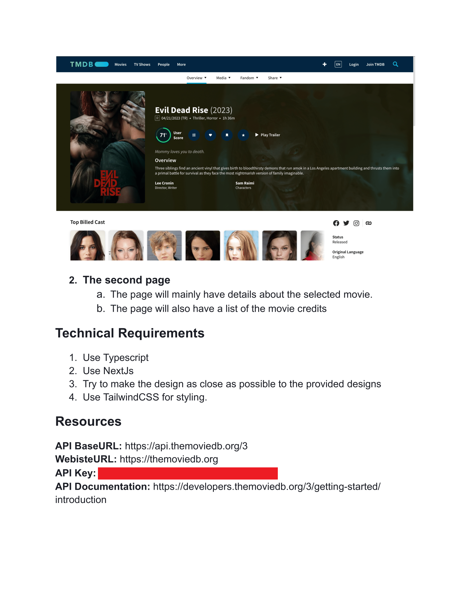

# Test Assignment for CLub Feast




## About The Test

This test was completed within a period of 3 days to perform the consumption of The Movie Database website's API, and below are some features about the test:

#### Main Page
Hidden API key through environment variable.
The menu title is dynamic according to the displayed category.
Implemented a menu for choosing movie categories by clicking the Sort button, and applied colors for the Focus and Selected states.
The entire Navbar and the rest of the sidebar are decorative, only to replicate the proposed layout.

#### Movies Page
Implemented a color system for the buttons below the Navbar.
Applied verification for the cast images of the movies, as not all of them have photos, and in case they don't, a custom design was implemented to indicate that there is no image available.

#### Final Considerations
The project could be improved if there was more time to better componentize the code and identify fonts, font sizes, and margins.
Responsiveness was not requested.
Due to time constraints, I didn't create a button to return to the main menu, but considering everything that was done, it's a minor detail.

## Live Project
[Live Project](https://alessandrogeras.github.io/app/)


## Getting Started
This is a [Next.js](https://nextjs.org/) project bootstrapped with [`create-next-app`](https://github.com/vercel/next.js/tree/canary/packages/create-next-app).

First, run the development server:

```bash
npm run dev
# or
yarn dev
```

Open [http://localhost:3000](http://localhost:3000) with your browser to see the result.

You can start editing the page by modifying `pages/index.tsx`. The page auto-updates as you edit the file.

[API routes](https://nextjs.org/docs/api-routes/introduction) can be accessed on [http://localhost:3000/api/hello](http://localhost:3000/api/hello). This endpoint can be edited in `pages/api/hello.ts`.

The `pages/api` directory is mapped to `/api/*`. Files in this directory are treated as [API routes](https://nextjs.org/docs/api-routes/introduction) instead of React pages.

## Learn More

To learn more about Next.js, take a look at the following resources:

- [Next.js Documentation](https://nextjs.org/docs) - learn about Next.js features and API.
- [Learn Next.js](https://nextjs.org/learn) - an interactive Next.js tutorial.

You can check out [the Next.js GitHub repository](https://github.com/vercel/next.js/) - your feedback and contributions are welcome!

## Deploy on Vercel

The easiest way to deploy your Next.js app is to use the [Vercel Platform](https://vercel.com/new?utm_medium=default-template&filter=next.js&utm_source=create-next-app&utm_campaign=create-next-app-readme) from the creators of Next.js.

Check out our [Next.js deployment documentation](https://nextjs.org/docs/deployment) for more details.
